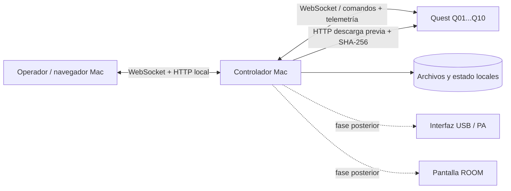

# Arquitectura y plan verificable

## Decisiones

1. **Quest:** desarrollar en Unity para Android/Quest con OpenXR y Meta XR SDK. Unity permite lobby 3D en tiempo real, un reproductor de archivo local y acceso a telemetría del sistema. La documentación de Unity indica que `VideoPlayer.Prepare()` prepara recursos antes de `Play()`, pero el tiempo y formato soportados se deben medir en Quest 3S con los archivos finales. [Meta: requisitos Unity/Quest](https://developers.meta.com/horizon/documentation/unity/unity-development-requirements/), [Unity: VideoPlayer.Prepare](https://docs.unity3d.com/6000.0/Documentation/ScriptReference/Video.VideoPlayer.Prepare.html).
2. **Mac:** proceso Node.js independiente del navegador. Expone HTTP para contenido, WebSocket para control y dashboard, y guarda `data/state.json` por reemplazo atómico. El contenido fuente permanece en `data/content/`.
3. **Red:** router con DHCP sin Internet, Mac por Ethernet, Quest por Wi-Fi; AP adicionales cableados. Alimentación protegida para Mac, router/AP y futura interfaz de audio. El dashboard se limita a loopback en este hito.
4. **Identidad:** Q01–Q10 son ranuras físicas de operación. Cada Quest debe provisionarse con un ID único y una dirección estable del controlador. El prototipo usa un token compartido; reemplazarlo antes de uso de producción.

## Estados y autoridad

El controlador conserva **estado deseado**: evento, experiencia, selección, fase, generación y origen temporal. Cada Quest conserva **estado observado**: archivo validado, batería, carga, reproducción, posición, error y medición de reloj. El dashboard presenta ambos. A los cinco segundos sin telemetría, un Quest se marca offline y su estado observado vigente desaparece; la última recepción queda visible. Ninguna falla individual manda STOP a los demás.

Fases del controlador: `IDLE → PREPARING → READY → SCHEDULED → PLAYING → PAUSED`, con `STOP/LOBBY → IDLE`. Un comando `PREPARE` solo se envía tras validar SHA-256 reportado. `PLAY` requiere todos los Quest seleccionados online, con contenido correcto, READY, batería ≥20 % y medición de reloj menor de 15 segundos con RTT <100 ms. Se anuncia un tiempo futuro; cada cliente arranca localmente. El controlador no distribuye cuadros de video durante PLAY.

Las advertencias de batería 20–39 % y verificación física de red no bloquean el prototipo; batería inferior a 20 % sí. El panel **no certifica** router, alcance de Wi-Fi, audio, archivo reproducible o precisión audiovisual. La marca `LISTO PARA PRUEBA` es deliberada.

## Sincronización y límites

El cliente estima offset de reloj por intercambio de cuatro tiempos estilo NTP: envío local, recepción y respuesta de Mac, recepción local. Repite la medición cada tres segundos. El simulador usa `Date.now()` con sesgo configurado; esto sirve para comprobar el protocolo, pero es sensible a saltos del reloj del sistema y no modela decodificación, VSYNC, buffering ni audio. El dashboard calcula `drift = posición observada − posición maestra en el instante de telemetría`. La tolerancia preliminar de pre-flight se basa en RTT; **no es una promesa de precisión audiovisual**.

Para la app Quest, usar reloj monotónico con correlación periódica al servidor, registrar tiempos de primera imagen y audio, filtrar mediciones de RTT alto y mantener un error estimado. Correcciones pequeñas deben usar ajuste de velocidad si el reproductor lo permite sin artefactos; desviaciones grandes requieren RESYNC explícito con seek en un punto seguro. No automatizar saltos perceptibles hasta medirlos. Si se pierde Wi-Fi, continuar el archivo local. Al reconectar, enviar telemetría y snapshot, comparar posición y proponer o ejecutar resync según el umbral validado en pruebas.

## Distribución

El controlador calcula SHA-256 sobre el archivo fuente al registrar la experiencia. Cada Quest descarga por HTTP en bloques, puede reanudar desde `.part`, compara tamaño y SHA-256, y solo entonces informa `READY` para ese hash. Un hash distinto bloquea PREPARE/PLAY. El prototipo verifica espacio libre reportado con margen de 500 MiB; medir espacio real en Android y mantener al menos una copia de seguridad. Para 10 Quest, limitar concurrencia, medir throughput del AP, planificar la distribución antes de abrir puertas y evitar saturar el Wi-Fi durante show.

## Hitos

| Hito | Entrega | Criterio de aceptación |
| --- | --- | --- |
| 0.1 · núcleo simulado | Controlador, dashboard, protocolo, descarga, checksum, READY, inicio futuro, heartbeat, reconexión | `npm test` pasa sin Internet; estados offline y ACK visibles; no se afirma sincronía física |
| 0.2 · dos Quest reales | Unity/Android, lobby simple, reproducción de un archivo local, batería, almacenamiento y tiempo real de video | Repetir escenarios de 0.1 en 2 Quest 3S; registrar formato/codec/resolución/fps, primera imagen, drift y fallos con logs exportables |
| 0.3 · robustez VR | Lobby configurable, identificación, resync medido y recuperación tras cierre/reinicio | Medición repetida con archivo final; umbral aceptado por dirección creativa y operador; ninguna falla individual detiene al otro visor |
| 0.4 · escala | Diez Quest, distribución programada y red final | Diez copias verificadas; ensayo completo offline; métricas de cobertura, transferencia, batería y drift por visor |
| 0.5 · canales Mac | AUDIO PA y ROOM con interfaz/salida elegible, errores visibles, timeline común | Prueba de sincronía VR/PA/ROOM en hardware, mute físico y recuperación de dispositivo de audio |
| Posterior | OSC, Art-Net/DMX, cues, haptics, salas, tablet | Contratos de eventos separados del núcleo temporal |

## Ensayo de hardware obligatorio antes de show

1. Confirmar el codec, bitrate, resolución, proyección 180/360 y audio del **archivo final**; probarlo completo, repetidamente, en cada Quest 3S. «8K» en el nombre no acredita decodificación real.
2. Medir inicio físico con una señal visual de cuadro y una referencia de audio capturadas con cámara de alta velocidad o instrumento equivalente. Guardar mediana, P95, máximo y número de muestras; separar offset de reloj, primer cuadro visible y drift de reproducción. Definir tolerancia aceptable según la pieza antes de declarar listo el show.
3. Repetir PLAY, pausa y resync; cortar Wi-Fi de un Quest durante PLAY; comprobar que sigue mostrando video local y que los demás continúan. Reconectar y registrar el comportamiento.
4. Cerrar/reabrir dashboard; detener/reiniciar controlador; comprobar continuidad local de los Quest y pérdida temporal de PA/ROOM cuando se implementen. Probar router sin Internet, archivo corrupto, batería baja y reloj desfasado.
5. Verificar cobertura e interferencia en el venue con diez visores, Mac por Ethernet, AP cableados, interfaz USB y alimentación protegida. Ensayar desde puertas cerradas hasta fin de experiencia.

## Riesgos actuales

- No hay app nativa ni medición de video en Quest: el simulador solo valida transporte y lógica de control.
- `Date.now()` y WebSocket en LAN no garantizan precisión audiovisual. Migrar el reloj de ejecución a monotónico y medir salida física.
- El token compartido en URL y HTTP sin TLS son adecuados solo para una LAN aislada de laboratorio. Provisión y autenticación por visor son requisito antes de show.
- El servidor WebSocket incluido acepta mensajes de texto pequeños y sin fragmentación; reemplazarlo por una implementación probada antes de ampliar interoperabilidad y escala.
- AUDIO PA/ROOM aún no existen. Si la Mac cae, esos canales dejarán de sonar o verse; la reproducción VR local debe continuar.
