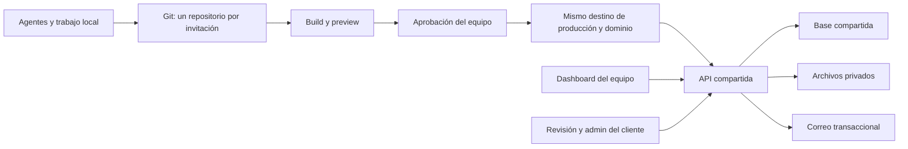

# Plataforma compartida de invitaciones

Propuesta del 22 de septiembre de 2026. Documento de diseño: todavía no existe una plataforma desplegada ni se modificaron las invitaciones existentes.

## Actualización aprobada el 24/09/2026

Para nuevas invitaciones se elige **Cloudflare + nueva D1 compartida + R2 privado**, conservando todos los eventos anteriores donde están. La primera implementación separa el panel/API de OTRORAYO de Valeria & Zachary. El detalle y estado real están en [IMPLEMENTACION.md](IMPLEMENTACION.md) y el [plan actualizado](PLAN_PLATAFORMA_Y_VALERIA_ZACHARY.md).

El formulario conserva **los integrantes juntos** en texto y pide **un email obligatorio de quien responde**. Ese contacto recibe la información del grupo; no se pide mail a cada integrante ni se infiere un número de personas. Paneles y cupos cuentan grupos. El email del equipo inicial es `invitaciones.otrorayo@gmail.com`; su contraseña se ingresa al desplegar.

Las opciones PostgreSQL/Hyperdrive descritas más abajo quedan como antecedentes descartados para la primera plataforma nueva. El correo real requiere remitente propio configurado; la entrega local funciona en captura. La cadena automática de publicación es una etapa pendiente, no una garantía actual.

## Lo acordado

- Se aplica primero a las invitaciones nuevas. Las anteriores siguen funcionando donde están.
- Dos integrantes del equipo, ambos con acceso a todos los proyectos. Responsable de notificaciones configurable por proyecto.
- Cada diseño se crea desde cero con agentes de IA. No se impone un catálogo visual.
- El cliente entra con una clave por proyecto, edita contenido y lo publica al guardar. Hay historial y recuperación.
- Los campos pueden variar: textos, botones, enlaces, teléfonos y otros campos declarados por cada invitación. Debe admitir celebraciones de varios días.
- El cliente genera tickets seleccionando un elemento, escribiendo y adjuntando captura o audio.
- El equipo resuelve tickets localmente con IA y sube el código a Git. Una persona del equipo aprueba la publicación.
- El dashboard muestra proyectos, URLs, accesos, responsables, invitados, exportaciones, fechas, tickets y publicaciones. Cada web conserva `/admin`.
- El cierre de confirmaciones es automático, con reapertura manual. Mensaje inicial: «Ya se terminó el tiempo para confirmar».
- Después del evento, el mismo dominio entra automáticamente en demo. Cada nueva carga de la web inicia una cuenta de 30 días que disminuye mientras permanece abierta.
- El formulario de demo envía un correo de prueba al visitante y no registra invitados reales.

## Dos decisiones pendientes

1. **Base física:** conservar PostgreSQL existente o crear una base D1 compartida exclusivamente para las nuevas webs. No son motores intercambiables. Hasta decidirlo, el contrato de las webs usa una API independiente del motor.
2. **Leads de demo:** falta confirmar si el email del visitante se guarda como lead, si además se notifica al equipo o si solamente se envía el mail al visitante. No activar captura de leads mientras siga pendiente.

## Qué se verificó en María Pía

Se leyó la copia local `/Users/santiagosonzini/Desktop/mariapiaxv`; no se verificó que coincida exactamente con la última revisión remota. GitHub privado no estuvo accesible porque no hay sesión iniciada.

- `package.json`: Next.js 14, React 18, Prisma 5 y Nodemailer.
- `prisma/schema.prisma`: PostgreSQL; modelos Event, Guest, Admin, Message y PaymentReceipt. Los invitados y mensajes tienen `eventId`.
- `src/lib/supabase-storage.ts`: archivos mediante Supabase Storage.
- `src/app/actions/sendEmail.ts`: envío por SMTP.
- `src/components/invitacion/page.tsx`: la pantalla de confirmaciones cerradas está incorporada directamente en el componente.
- `src/app/actions/guests.ts`: varios datos del evento y del correo están escritos en código. El esquema Event no contiene fechas de evento ni de cierre.
- `src/app/admin/page.tsx`: panel vinculado al evento configurado en el sitio.

El nuevo estándar debe centralizar estas reglas. No se debe copiar indiscriminadamente el backend ni los comandos de migración de una invitación a cada nuevo repositorio.

## Arquitectura propuesta



**Repositorios:** uno para la plataforma y su contrato/SDK, otro como starter y uno por invitación. Todos trabajan sobre Git; WhatsApp puede quedar para conversación, pero no es el lugar donde se guarda la última versión. Un SDK inicial puede vivir versionado en el repositorio de plataforma sin exigir un registro de paquetes pago.

Los agentes suben sus ramas al repositorio de la invitación. La plataforma relaciona proyecto, commits, previews y tickets mediante la integración de Git; no necesita ejecutar agentes dentro del dashboard ni leer todo el código en cada visita.

**Hosting:** Cloudflare Workers Static Assets para diseños estáticos o React/Vite, con un Worker pequeño por sitio si necesita rutas de API en el mismo origen. API y dashboard compartidos. El diseño puede incluir animación o WebGL. Usar Next.js con servidor solo cuando el proyecto lo necesite y se haya validado su adaptación a Workers; la aplicación Next/Prisma existente no se convierte en estática con solo cambiar el hosting.

**Datos:** solamente el backend central tiene credenciales de base de datos. Cada web conoce un `projectId` público y utiliza el contrato publicado. Ninguna invitación crea tablas, ejecuta migraciones o recibe credenciales globales. El servidor verifica el proyecto autorizado en cada operación; no confía solamente en el ID enviado por el navegador.

**Opción PostgreSQL:** conservar la base física actual, crear un esquema separado para la plataforma y usar un rol limitado a ese esquema. Las tablas de las webs anteriores se conservan. El backend central es el único dueño de migraciones compatibles y versionadas. Antes de conectar se revisan permisos, capacidad y proveedor, sin asumir que Supabase Storage implica que la base esté alojada en Supabase. Cloudflare Hyperdrive permite conectar Workers con PostgreSQL. Desactivar su caché de consultas para contenido editable, permisos y confirmaciones.

**Opción D1:** una base compartida para todas las invitaciones nuevas; las existentes conservan su PostgreSQL. Se implementa el backend para D1. Esto no cumple literalmente «usar la misma base física anterior» y requiere elegir expresamente esta variante.

**Archivos:** R2 privado para audios, capturas y adjuntos del nuevo sistema. URLs temporales con autorización; no publicar audios o comprobantes en el contenido público. Mantener los archivos de las webs actuales donde están.

## Contrato que debe cumplir cualquier diseño

Cada proyecto entrega un manifiesto versionado, por ejemplo `invitation.manifest.json`, con identificadores estables de campos y secciones. Los siguientes nombres son una propuesta de contrato, no endpoints ni paquetes existentes.

```json
{
  "contractVersion": "1",
  "projectId": "ASIGNADO_POR_LA_PLATAFORMA",
  "fields": [
    { "id": "hero.title", "label": "Título principal", "type": "text", "maxLength": 100, "editor": "client" },
    { "id": "rsvp.submit.label", "label": "Texto del botón", "type": "text", "maxLength": 45, "editor": "client" },
    { "id": "contact.phone", "label": "Teléfono de contacto", "type": "phone", "editor": "client" },
    { "id": "venue.map", "label": "Enlace al mapa", "type": "url", "editor": "client" }
  ],
  "sections": [
    { "id": "hero", "label": "Portada" },
    { "id": "rsvp", "label": "Confirmación" }
  ]
}
```

Las jornadas son una colección con IDs estables: ceremonia, fiesta, segundo día, etc. Cada una puede tener lugar, inicio, fin, cierre de confirmación y preguntas propias. No usar posiciones de un array como identidad persistente. Las fechas operativas quedan inicialmente reservadas al equipo.

Los valores editables viven en la base central. Los textos del repositorio son valores iniciales; el alta es idempotente y nunca sobreescribe contenido guardado. Un deploy de código no restaura esos valores iniciales.

La API versionada separa lectura pública, confirmaciones públicas validadas, acciones del cliente y acciones del equipo. Solo devuelve contenido público en el primer grupo; invitados, claves, tickets y contactos privados requieren autorización.

## Edición instantánea y trabajo simultáneo

- `/revision` muestra la invitación y permite editar sus campos declarados. Guardar aplica el cambio al sitio y crea una revisión con autor y hora; no requiere deploy.
- Cada guardado incluye la versión base. Si otra persona cambió el mismo contenido, se muestra el conflicto en vez de sobrescribir silenciosamente.
- El editor actualiza su vista al guardar. El sitio obtiene contenido vigente al cargar o recuperar foco; se puede añadir un sondeo moderado para pestañas abiertas. No hace falta mantener conexiones en tiempo real para el MVP.
- El endpoint de contenido mutable comienza sin caché compartida. Si luego se añade caché, invalidarla forma parte del guardado. El hosting de fotos/JS/CSS sí puede usar caché.
- El historial permite restaurar contenido con una nueva revisión. Un rollback del código no revierte automáticamente ediciones del cliente.
- Los campos editables de escenas WebGL deben recibir datos o texturas regenerables. Texto incrustado definitivamente en una imagen no es editable instantáneamente; se trata como ticket de diseño.

## Accesos

- Dos cuentas individuales del equipo con alcance global. Clave de cliente por proyecto y sesión limitada a ese proyecto.
- El dashboard incluye accesos a web, revisión y admin, y permite mostrar/copiar o rotar la clave compartida del cliente, como fue solicitado.
- Esa clave compartida se trata como secreto recuperable: cifrado del lado servidor con clave de cifrado externa a la base, acceso exclusivo del equipo y registro de consulta/rotación. Las contraseñas personales del equipo se guardan únicamente como hashes; no son recuperables ni aparecen en el dashboard.
- Abrir el admin desde el dashboard puede usar un código de ingreso de un solo uso y corta duración, intercambiado por una sesión local. No colocar claves reutilizables en URLs.
- Autenticación en dominio propio mediante rutas del sitio hacia la API; evitar depender de cookies de terceros dentro de un iframe.

## Tickets y entrega a los agentes

El cliente elige una sección o elemento y escribe o graba audio. Guardar `projectId`, ID estable del elemento, URL, versión publicada, tamaño de pantalla y adjuntos. En WebGL ofrecer secciones/hotspots registrados: no asumir que cada elemento tiene un nodo DOM seleccionable. Si el navegador no permite capturar automáticamente la web, permitir adjuntar una captura manual.

El dashboard ofrece «Copiar contexto para IA»: descripción, adjuntos autorizados, repositorio, rama base, versión afectada y criterios de aceptación. Grabar y reproducir audio entra en el MVP; transcribirlo automáticamente es opcional y no se presupone gratis.

Estados: abierto → en trabajo → listo para revisar → aprobado → publicando → publicado. Si falla el deploy, mostrar fallo y mantener el ticket pendiente. Los correos avisan al responsable elegido; el dashboard es la fuente de estado. Un cambio de contenido puede resolverse con una revisión de contenido sin pasar por build.

En tickets mixtos, preparar código compatible y publicar primero la versión aprobada; después aplicar el parche de contenido autorizado con control de su versión base. Si el cliente editó esos campos entre tanto, resolver el conflicto. Cerrar el ticket cuando ambas partes estén verificadas. Las ediciones habituales del cliente siguen siendo instantáneas.

El equipo clona el repositorio, crea una rama y usa su agente habitual. El agente prepara cambios y preview. La aprobación corresponde a un commit y artefacto exactos; nuevos cambios invalidan esa aprobación. Un proceso de publicación del lado servidor, con credenciales fuera del alcance del agente y del build de la invitación, publica esa versión en el destino registrado. La implementación de este control debe comprobarse antes de habilitar publicación automática.

Serializar publicaciones por proyecto y comprobar que la versión de producción siga siendo la base esperada. Si otra corrección se publicó primero, integrar sus cambios, generar una nueva preview y renovar la aprobación. Una versión aprobada pero desactualizada no puede pisar una publicación más reciente.

GitHub Free no impone revisiones mediante protección de ramas en repositorios privados. No presentar «solo hacemos merge cuando aprobamos» como una barrera técnica. Para seguir gratis, la aprobación debe validarse en el publicador de la plataforma y no dejar un segundo camino automático de push → producción que la evite. Alternativa: elegir un plan GitHub con protección de ramas.

El registro del proyecto conserva proveedor, cuenta, identificador del destino y dominios. El primer alta y DNS se revisan manualmente. Las actualizaciones reutilizan ese destino; no crean un sitio nuevo. Registrar el resultado real del deploy, comprobar salud/versión en producción y recién entonces cerrar el ticket. Webhooks autenticados e idempotentes; repetir un evento no publica ni notifica dos veces.

## Fechas y demo

- Zona inicial `America/Argentina/Cordoba`. Guardar instantes UTC y zona de presentación.
- El servidor decide si puede aceptar confirmaciones. Ocultar el formulario no alcanza.
- Cerrar al alcanzar la fecha/hora configurada; el equipo puede reabrir. Definir alcance por proyecto o jornada según su formulario.
- Asunción propuesta: entrar en demo al finalizar la última jornada, usando una fecha/hora de fin explícita. No hacerlo al comenzar una fiesta que termina de madrugada.
- Resolver automáticamente el modo al consultar el proyecto y enviar formularios. No hace falta un deploy ni depender exclusivamente de una tarea programada.
- En demo, capturar una vez `t0` al cargar la página y contar hacia `t0 + 30 días`. No recalcular el destino cada segundo. Una recarga completa vuelve a 30 días, según lo pedido.
- Comportamiento propuesto para coherencia: desplazar también las fechas visibles declaradas en la invitación para que coincidan con el contador virtual, manteniendo las distancias entre jornadas. Distinguir la experiencia de demostración y mantener las fechas reales intactas en la base y el admin. Esto es una decisión de diseño propuesta, no un cambio ya aplicado a las webs existentes.
- Toda interacción pública que normalmente escriba datos —RSVP, mensajes, comprobantes— debe tener tratamiento demo. No guardar invitados, acompañantes, mensajes de evento ni comprobantes reales. Desactivar carga de comprobantes en demo.
- El correo al visitante se identifica como demostración. Captura de leads y aviso al equipo permanecen pendientes de confirmación. Si se habilitan, guardar en una tabla separada, con origen del proyecto y aviso claro en el formulario.

## Presupuesto inicial y límites

Precios consultados el 22/09/2026. Objetivo: costo de infraestructura de cero o pocos dólares con poco uso; no incluye dominios, herramientas de IA ni garantiza gratuidad al escalar.

| Servicio | Cuota relevante |
| --- | --- |
| Workers Static Assets | Solicitudes estáticas gratuitas e ilimitadas; máximo de archivo 25 MiB. |
| Worker API, plan Free | 100.000 solicitudes/día por cuenta; 10 ms CPU por ejecución. Medir especialmente autenticación y validaciones. |
| Workers Paid | Mínimo US$5/mes por cuenta, con cuotas incluidas y excedentes medidos. |
| Hyperdrive Free, si se conserva PostgreSQL | 100.000 sentencias SQL/día; el alojamiento de PostgreSQL se paga o limita por separado. |
| D1 Free, si se elige base nueva | 5 millones de filas leídas/día, 100.000 escritas/día; 500 MB por base, 5 GB totales por cuenta. |
| R2 Standard | 10 GB-mes, 1 millón de operaciones A y 10 millones B mensuales gratis; exceso facturable. |
| Workers Builds Free | 3.000 minutos/mes y un build simultáneo. |
| Resend Free | 3.000 correos/mes y máximo 100 diarios; cada destinatario cuenta. |

Los planes Free de API/base pueden rechazar operaciones al agotar cuotas. R2 puede cobrar exceso una vez habilitada su facturación. Revisar las condiciones de activación y límites de la cuenta al dar de alta recursos.

Para correos nuevos, usar un remitente central de la agencia verificado, con nombre visible del evento; así no se necesita verificar un dominio distinto por invitación. El mail será probablemente el primer límite: 60 formularios con copia al visitante y al equipo ya requieren 120 destinatarios. Si falla el correo después de guardar un RSVP, mantener el registro y reintentar el envío de forma idempotente; no pedir al visitante que duplique su confirmación. Las demos necesitan límites de frecuencia para evitar agotar la cuota.

## Orden de implementación

1. Elegir base física y comportamiento de leads. Crear el repositorio de plataforma, el contrato, autenticación y datos compartidos en entorno de prueba.
2. Construir un starter con un diseño de prueba, editor, `/admin`, RSVP, historial y demo. Probar dos proyectos para verificar aislamiento y que un deploy conserve ediciones.
3. Incorporar dashboard, tickets, adjuntos y exportación de contexto para agentes.
4. Conectar Git, previews, aprobación de versión y publicación al destino existente. Verificar fallos y rollback.
5. Hacer una invitación real nueva con el prompt y el starter; después reutilizar el flujo. Las webs anteriores pueden incorporarse mediante adaptadores en otra etapa.

El prompt puede redactarse ahora; la garantía técnica de reutilización depende de construir y verificar este contrato/starter. No prometer integración o deploy si los servicios aún no existen.

## Fuentes oficiales

- [Workers Static Assets: costos y límites](https://developers.cloudflare.com/workers/static-assets/billing-and-limitations/)
- [Workers: precios](https://developers.cloudflare.com/workers/platform/pricing/) y [límites](https://developers.cloudflare.com/workers/platform/limits/)
- [Workers Builds](https://developers.cloudflare.com/workers/ci-cd/builds/limits-and-pricing/) y [dominios propios](https://developers.cloudflare.com/workers/configuration/routing/custom-domains/)
- [Hyperdrive: precios](https://developers.cloudflare.com/hyperdrive/platform/pricing/) y [caché](https://developers.cloudflare.com/hyperdrive/concepts/query-caching/)
- [D1: precios](https://developers.cloudflare.com/d1/platform/pricing/) y [límites](https://developers.cloudflare.com/d1/platform/limits/)
- [R2: precios](https://developers.cloudflare.com/r2/pricing/)
- [Resend: cuotas](https://resend.com/docs/knowledge-base/account-quotas-and-limits) y [dominio de pruebas](https://resend.com/docs/knowledge-base/403-error-resend-dev-domain)
- [GitHub: disponibilidad de protección de ramas](https://docs.github.com/en/repositories/configuring-branches-and-merges-in-your-repository/managing-protected-branches/about-protected-branches)
- [Vercel Hobby: uso personal no comercial](https://vercel.com/docs/plans/hobby)
